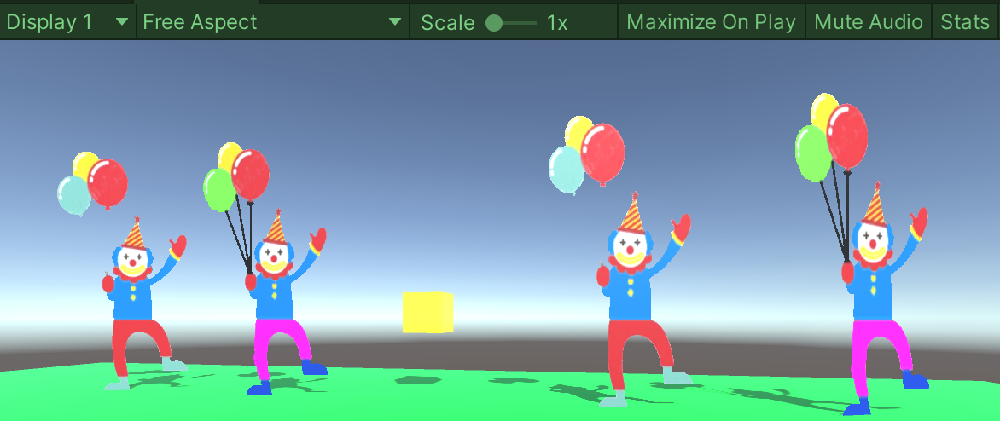

# Billboard_Modes
Different Billboard Modes for Unity.
Use a PNG with transparency.

## Billboards

Billboards are 2D elements in a 3D world.
You can rotate this billboards with code, so the always look to the "users main cam".

